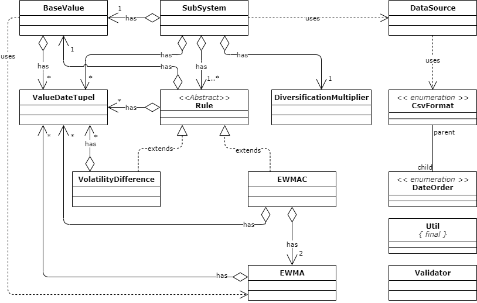

# This project

This reposity is the project accompanying my Master's thesis in IT-Management. The goal of the thesis is to develop a library which can be used to predict the future development of certain base values, such as stock prices or comparable assets. The library should meet at least the requirements for insurance companies' simple adoption but exceeds this requirement by actually being applicable to all kind of investors, institutional or private.

# Project structure

[Full class diagram](https://app.diagrams.net/?lightbox=1&highlight=0000FF&edit=_blank&layers=1&nav=1#G1tA72QX0PsenfbbcztCDftiMQY1XcAloq)

# Requirements

- Java Development Kit 11

# Installing

`mvn install`

# Stack

| task              | tool                         |
| ----------------- | ---------------------------- |
| buildtool         | Maven modelVersion 4.0.0     |
| testing appliance | maven-surefire-plugin 2.21.0 |
| testing API       | junit-jupiter 5.6.2          |
| test coverage     | jacoco-maven-plugin 0.8.5    |

# Resources

## Functional

Robert Carver, Systematic Trading (2015), HARRIMAN HOUSE LTD.

## Libraries

- org.junit.jupiter:junit-jupiter-api:5.6.2

  https://mvnrepository.com/artifact/org.junit.jupiter/junit-jupiter-api

  Scope: test

- org.apache.commons:commons-lang3:3.10

  https://mvnrepository.com/artifact/org.apache.commons/commons-lang3

- org.apache.commons:commons-math3:3.6.1

  https://mvnrepository.com/artifact/org.apache.commons/commons-math3

- log4j:log4j:1.2.17

  https://mvnrepository.com/artifact/log4j/log4j
